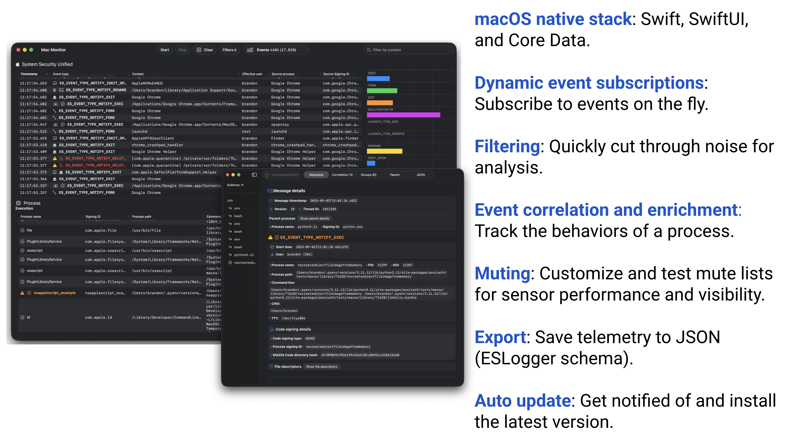
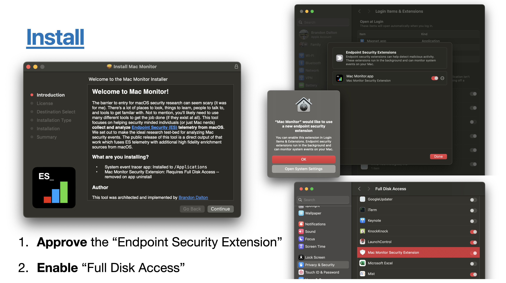
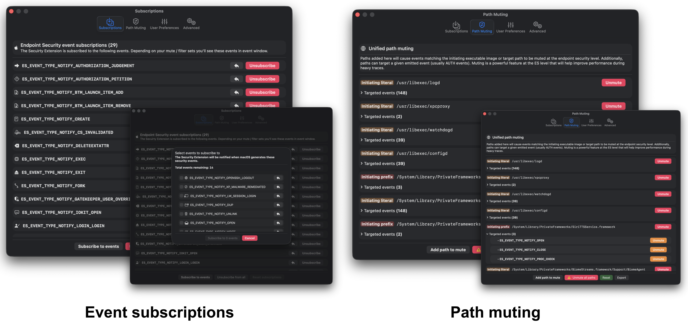
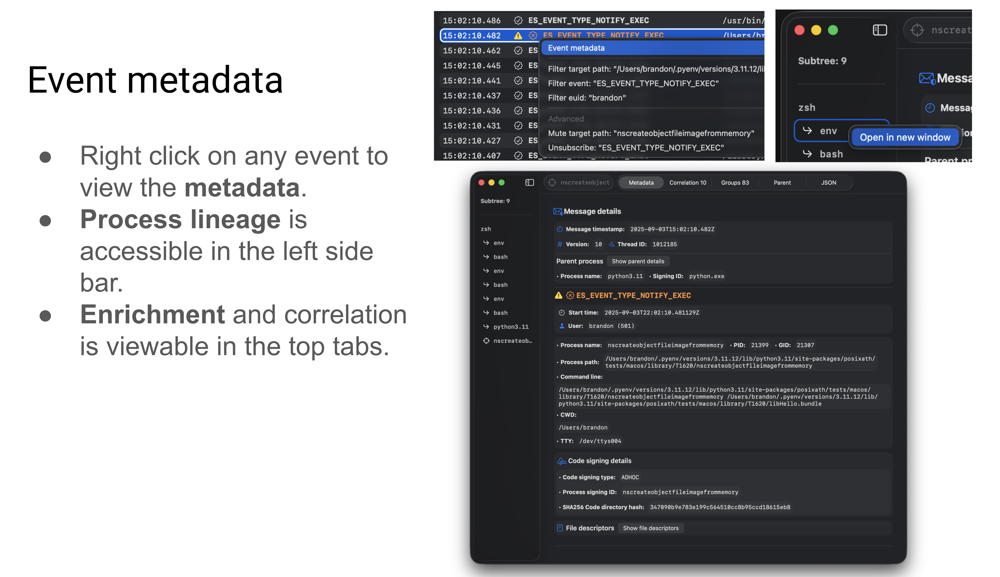
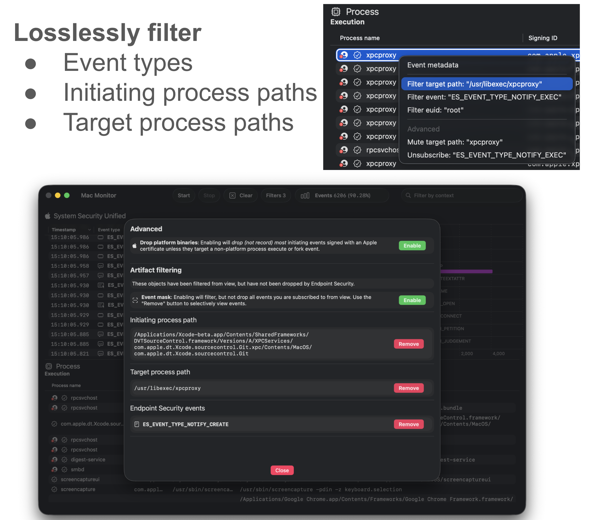
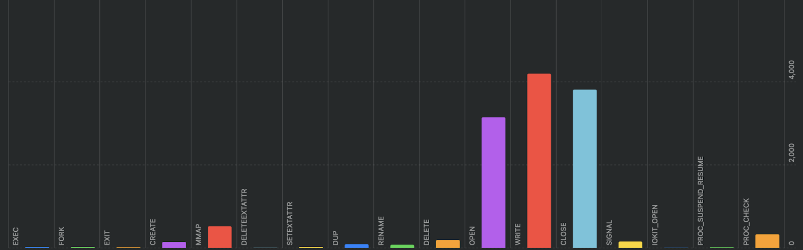

## 🎉 Welcome to "Mac Monitor's" official new home!


Mac Monitor is an **advanced, stand-alone system monitoring tool tailor-made for macOS security research, malware triage, and system troubleshooting**. Leveraging Apple's Endpoint Security (ES) and System Extension APIs, it collects and enriches system events, displaying them graphically, with an expansive feature set designed to surface only the events that are relevant to you. The telemetry collected includes process, interprocess, memory, XPC, file events, and more in addition to rich metadata, allowing users to contextualize events and tell a story with ease. With an intuitive interface and a rich set of analysis features, Mac Monitor was designed for a wide range of skill levels and backgrounds to detect macOS threats that would otherwise go unnoticed. 

### OBTS v8.0 Presentation
**Introducing the Next Generation of Mac Monitor**:
* [📊 Slides](https://swiftlydetecting-conferences.s3.us-west-2.amazonaws.com/public/2025/OBTSv8/Introducing+the+Next+Generation+of+Mac+Monitor.pdf)
* [📺 YouTube](https://www.youtube.com/watch?v=h_i_H6RzzHA)


## Requirements
- Processor: We recommend an `Apple Silicon` machine, but `Intel` works too!
- System memory: `4GB+` is recommended
- macOS version: `13.1+` (Ventura)


## How can I install this thing?

**☕️ (Recommended) Homebrew**
* `brew install --cask mac-monitor`

**📦 Installer package**
* Go to the releases section and download the latest installer: https://github.com/Brandon7CC/mac-monitor/releases

**Install**
* Open the app: `Mac Monitor.app`
* You'll be prompted to "Open System Settings" to "Allow" the System Extension.
* Next, System Settings will automatically open to `Full Disk Access` -- you'll need to flip the switch to enable this for the `Mac Monitor Security Extension`. Full Disk Access is a [*requirement* of Endpoint Security](https://developer.apple.com/documentation/endpointsecurity/3259700-es_new_client#:~:text=The%20user%20does%20this%20in%20the%20Security%20and%20Privacy%20pane%20of%20System%20Preferences%2C%20by%20adding%20the%20app%20to%20Full%20Disk%20Access.).
* 🏎️ Click the "Start" button in the app and you'll be prompted to reopen the app. Done!



### Install footprint
- Event monitor app which establishes an XPC connection to the Security Extension: `/Applications/Mac Monitor.app` w/signing identifier of `com.swiftlydetecting.agent`.
- Security Extension: `/Library/SystemExtensions/../com.swiftlydetecting.agent.securityextension.systemextension` w/signing identifier of `com.swiftlydetecting.agent.securityextension.systemextension`.
- (`2.2.0+`) Command line tool: `/Applications/Mac Monitor.app/Contents/MacOS/macmonitor` w/signing identifier of `com.swiftlydetecting.agent.cli` (see [Command line](#command-line)).
- (`2.2.0+`) Only if you install it from Settings ▸ Command Line: the symbolic link `/usr/local/bin/macmonitor`, pointing at the tool inside the app. The installer package never creates it.
- (`2.2.0+`) Saved mute set: `/Library/Application Support/com.swiftlydetecting.agent.securityextension/mutes.json`, written by the Security Extension and readable only by `root` (see [Path mutes](#path-mutes)).


## Uninstall
* **From the Finder** delete the app and authenticate to remove the System Extension. You can't do this from the Dock. It's that easy!
* You can also *just* remove the Security Extension if you want in the app's menu bar or by going into the app settings.
* (`1.0.3+`) Supports removal using the `../Contents/SharedSupport/uninstall.sh` script. (`2.2.0+`) The script also deletes the saved mute set and, if it's Mac Monitor's, the `/usr/local/bin/macmonitor` link.
* (`2.2.0+`) If you installed the command line tool, use Settings ▸ Command Line ▸ Remove… before deleting the app from the Finder, or `sudo rm /usr/local/bin/macmonitor` after.


## Path mutes
Mac Monitor keeps one **saved mute set**. The Security Extension stores it at `/Library/Application Support/com.swiftlydetecting.agent.securityextension/mutes.json` (the directory `0700`, the file `0600`, both owned by `root`) and applies it to every Endpoint Security client it creates for Mac Monitor. It survives app relaunches, Security Extension restarts and reboots, and a change applies right away to a trace that's already running. `sudo macmonitor` uses the same set.

- **Settings ▸ Path Muting** lists the saved set. Right-click mutes in the event tables and the "Add path to mute" sheet add to it.
- **Import…** reads a mute file (below) or a list exported by Mac Monitor before 2.2 (Export ▸ Current mute set… in 2.1). It shows how many mutes the file holds and what was left out, then replaces the saved set or adds to it. Entries that can't change what Mac Monitor sees are left out with a note: Mac Monitor's clients only subscribe to `NOTIFY` events, so a mute that only names `AUTH` events changes nothing. That's every mute in Apple's default mute sets, such as the files in [`Mute sets/`](./Mute%20sets), so Import reads them but has nothing to add.
- **Export ▸ Saved mute set…** writes the saved set as a mute file. **Export ▸ Apple mute set…** writes Endpoint Security's own default mutes, which aren't part of the saved set.
- **Reset to Default** replaces the saved set with Mac Monitor's default set.
- **Only an administrator can change it.** On every change the Security Extension checks that the user running Mac Monitor is a member of the `admin` group. A standard user's Mac Monitor shows the saved set read-only: it can view and export the set, and records with it, but Path Muting's controls are off and a mute from an event's menu is refused with a note saying why. `sudo macmonitor` runs as root, so it can change the set.

The first time 2.2 runs, the saved set starts as Mac Monitor's default set. Mutes added in 2.1 only ever lived in the Security Extension's memory, so to keep them, use Export ▸ Current mute set… in 2.1 before updating and import that file in 2.2.

Two of the default set's mutes are per user: files created and renamed in `~/Library/Caches/`, and extended attributes read from files in `~/Library/Biome/streams/`. The Security Extension runs as root, so it uses the home folder of the user logged in at the console when it creates the saved set or resets it (Reset to Default, `macmonitor mute reset`, whose question names that user): `/Users/alice/Library/Caches/`, never root's. If no one is logged in at that moment (the login window, or only SSH sessions), those two mutes are left out and Path Muting says so; reset while you're logged in to add them. A saved set is never rewritten on its own, so after someone else logs in, the mutes stay on the first user's home folder until the next reset.

A muted path is a blind spot until it's unmuted, and now it stays one across restarts. Every change is logged with who made it (subsystem `com.swiftlydetecting.agent.securityextension`, category `SavedMuteSet`):

```
log show --predicate 'subsystem == "com.swiftlydetecting.agent.securityextension" && category == "SavedMuteSet"' --info
```

The mute file is JSON:

```json
{
  "mutes" : [
    { "events" : [], "path" : "/usr/libexec/logd", "type" : "ES_MUTE_PATH_TYPE_LITERAL" },
    { "events" : [ "ES_EVENT_TYPE_NOTIFY_MMAP" ], "path" : "/Library/Caches/", "type" : "ES_MUTE_PATH_TYPE_TARGET_PREFIX" }
  ],
  "version" : 1
}
```

- `type` is one of the four `ES_MUTE_PATH_TYPE_*` names. `PREFIX` and `LITERAL` match the initiating process's executable; `TARGET_PREFIX` and `TARGET_LITERAL` match the event's target.
- `events` lists `ES_EVENT_TYPE_*` names. Empty, or missing, means every event. A path muted for every event can't be narrowed one event at a time: remove it, then add it back for the events you want.
- Endpoint Security matches resolved paths, so use `/private/tmp/…`, `/private/var/…` and `/private/etc/…` rather than `/tmp/…`, `/var/…` and `/etc/…`.
- A mute file can be at most 1 MiB and hold at most 4,096 mutes, each naming at most 512 events.


## Command line
(`2.2.0+`) `macmonitor` streams Endpoint Security events from Mac Monitor's Security Extension to a terminal or a pipe, while Mac Monitor keeps recording. It ships inside the app: `/Applications/Mac Monitor.app/Contents/MacOS/macmonitor`.

**Install**: Settings ▸ Command Line ▸ Install… links `/usr/local/bin/macmonitor` to the tool inside the app, so `sudo macmonitor` works in any terminal. It asks for an administrator password first; the installer package never links the tool.
- **Remove…** deletes the link. After you move or rename Mac Monitor, **Update…** or **Repair…** points it at the copy you're running.
- Settings only changes `/usr/local/bin/macmonitor` when it's Mac Monitor's own link (a link to some `….app/Contents/MacOS/macmonitor`), and only as it was when you looked. A file or another program's link there is left alone.
- `sudo` runs the tool as root, so Settings links it only when the tool and every folder above it belong to `root` and only `root` and admins can change them, and the tool is signed as `com.swiftlydetecting.agent.cli`. The installer package installs Mac Monitor that way. A copy you dragged out of a zip belongs to you, so Install is refused. The zip a Community build makes records your user as the owner of every file, so extract it as root, then give it to root: `sudo ditto -x -k MacMonitor-community.zip /Applications`, then `sudo chown -R root:wheel "/Applications/Mac Monitor.app"`.
- Without the link, run the tool by its full path: `sudo "/Applications/Mac Monitor.app/Contents/MacOS/macmonitor" stream`.

```
sudo macmonitor stream                     # Mac Monitor's default events, as text on a terminal
sudo macmonitor stream exec fork exit      # only these events
sudo macmonitor stream all | jq -c .       # every event Mac Monitor models, as JSONL
sudo macmonitor stream open --no-mutes     # without the saved mute set
macmonitor events                          # the events macmonitor can stream (* marks the defaults)
sudo macmonitor mute list                  # the saved mute set (see Path mutes)
```

- **Output**: one line per event on a terminal (time, event, process, user, and Mac Monitor's summary of the event). Piped or redirected, one JSON record per line: the same records as Export telemetry ▸ JSONL (lines) in the menu bar, an eslogger superset. `--format text|jsonl` picks either. Control and bidirectional characters from event data are escaped before they reach a terminal.
- **Root only**: `stream` and `mute` need `sudo`. The Security Extension serves `macmonitor` only to root, checks its code signature, and gives each stream its own Endpoint Security clients, so a stream never changes what Mac Monitor records. Root gets every process's command line and environment this way, without Full Disk Access for the terminal (eslogger asks for it).
- **Mutes**: a stream applies the saved mute set, including changes made while it runs, unless you pass `--no-mutes`. Each change made while it runs is reported on standard error, with who made it: `macmonitor: Mac Monitor (pid 501) changed the saved mute set: 1 added, 0 removed, 0 changed, 79 mutes now. …` `sudo macmonitor mute list|add|remove|import|export|reset` reads and changes the same set as Settings ▸ Path Muting (`macmonitor help mute`). `import` and `reset` say what they'd change and ask first; in a script, add `--yes`. `mute export` (or `mute list --format json`) prints the set as a mute file. Muted events are never captured, so they never show up as lost.
- **Its own pipeline**: `macmonitor` leaves out the events of its own process group and of the `sudo` that runs it, so `| jq` doesn't stream `jq`'s own reads. `--include-self` shows them; `macmonitor`'s own process always stays out.
- **Lost events**: when Endpoint Security drops messages, or the reader can't keep up (the stream pauses rather than buffer without bound), `macmonitor` says so on standard error, at most once a second: `macmonitor: lost 120 events (open 100, close 20)`.
- **Limits**: at most 3 streams at once, each with 3 Endpoint Security clients. Endpoint Security's clients are shared by every Endpoint Security product on the Mac.
- **Stopping**: Ctrl-C writes every event captured up to that moment (on macOS 27, also those Endpoint Security still had queued), then exits 130. `| head` exits 0.
- **Exit status**: 0 success, 1 you answered no to `import` or `reset`, 64 usage (a command line macmonitor can't read, such as an unknown command, option or event to stream, a missing argument, or `import` or `reset` without a terminal to ask at and without `--yes`), 65 mutes that can't be used (such as `mute add` or `remove` with a relative path or an unknown `--type` or `--event`, a mute the Security Extension refuses, or a file to import with none it can use), 66 a file that can't be read, 69 the Security Extension isn't running, refused `macmonitor`, is out of date, lacks Full Disk Access, or keeps a saved mute set from a newer Mac Monitor, 70 a bug, 74 output, or the saved mute set couldn't be written, 75 too many streams or Endpoint Security clients, 77 not root, 128 + n a signal.


## What are some standout features?
- **High fidelity ES events modeled and enriched** with some events containing further enrichment. For example, a process being File Quarantine-aware, a file being quarantined, code signing certificates, etc.
- **Dynamic runtime ES event subscriptions**. You have the ability to on-the-fly modify your event subscriptions -- enabling you to cut down on noise while you're working through traces.
- **Path muting at the API level** -- Apple's Endpoint Security team has put a lot of work recently into enabling advanced path muting / inversion capabilities. Here, we cover the majority of the API features: `es_mute_path` and `es_mute_path_events` along with the types of `ES_MUTE_PATH_TYPE_PREFIX`, `ES_MUTE_PATH_TYPE_LITERAL`, `ES_MUTE_PATH_TYPE_TARGET_PREFIX`, and `ES_MUTE_PATH_TYPE_TARGET_LITERAL`. Right now we do not support inversion. **I'd love it if the ES team added inversion on a per-event basis instead of per-client**.


- **Detailed event facts**. **Right click on any event** in a table row to access event metadata, filtering, muting, and unsubscribe options. Core to the user experience is the ability to drill down into any given event or set of events. To enable this functionality we’ve developed “Event facts” windows which contain metadata / additional enrichment about any given event. Each event has a curated set metadata that is displayed. For example, process execution events will generally contain code signing information, environment variables, correlated events, etc. Below you see examples of file creation and BTM launch item added event facts.


- **Event correlation** is an *exceptionally* important component in any analyst's tool belt. The ability to see which events are "related" to one-another enables you to manipulate the telemetry in a way that makes sense (other than simply dumping to JSON or representing an individual event). We perform event correlation at the process level -- this means that for any given event (which have an initiating and/or target process) we can deeply link events that any given process instigated. 
- **Process grouping** is another helpful way to represent process telemetry around a given `ES_EVENT_TYPE_NOTIFY_EXEC` or `ES_EVENT_TYPE_NOTIFY_FORK` event. By grouping processes in this way you can easily identify the chain of activity.
- **Artifact filtering** enabled users to remove (but not destroy) events from view based on: event type, initiating process path, or target process path. This standout feature enables analysts to cut through the noise quickly while still retaining all data.
  - Lossy filtering (i.e. events that are dropped from the trace) is also available in the form of "dropping platform binaries" -- another useful technique to cut through the noise.



- **Telemetry export**. Right now we support pretty JSON and JSONL (one JSON object per-line) for the full or partial system trace (keyboard shortcuts too). You can access these options in the menu bar under "Export Telemetry".
- **Process subtree generation**. When viewing the event facts window for any given event we’ll attempt to generate a process lineage subtree in the left hand sidebar. This tree is intractable – click on any process and you’ll be taken to its event facts. **Similarly, you can right click on any process in the tree to pop out the facts for that event**.
- **Dynamic event distribution chart**. This is a fun one enabled by the SwiftUI team. The graph shows the distribution of events you're subscribed to, currently in-scope (i.e. not filtered), and have a count of more than nothing. This enables you to *very* quickly identify noisy events. The chart auto-shows/hides itself, but you can bring it back with the: "Mini-chart" button in the toolbar.




## Some other features
- Another very important feature of any dynamic analysis tool is to not let an event limiter or memory inefficient implementation get in the way of the user experience. To address this (the best we currently can) we’ve implemented an asynchronous parent / child-like **Core Data stack** which stores our events as “entities” in-memory. This enables us to store virtually unlimited events with Mac Monitor. Although, the time of insertions does become more taxing as the event limit gets very large.  
- Since Mac Monitor is based on a Security Extension which is always running in the background (like an EDR sensor) we baked in functionality such that it **does not process events when a system trace is not occurring**. This means that the Security Extension (`com.swiftlydetecting.agent.securityextension`) will not needlessly utilize resources / battery power when a trace is not occurring. 
- Distribution package: **The install process is often overlooked**. However, if users do not have a good understanding of what’s being installed or if it’s too complex to install the barrier to entry might be just high enough to dissuade people from using it. This is why we ship Mac Monitor as a notarized distribution package.