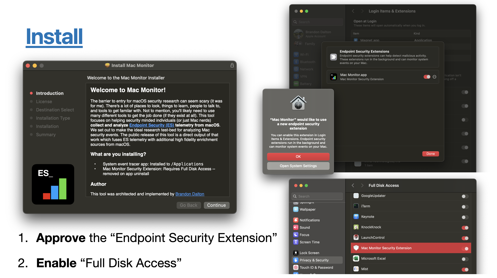
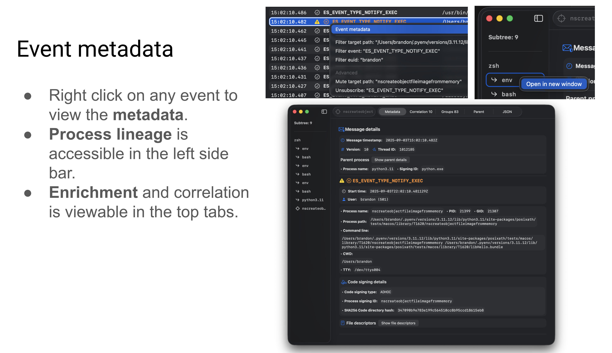
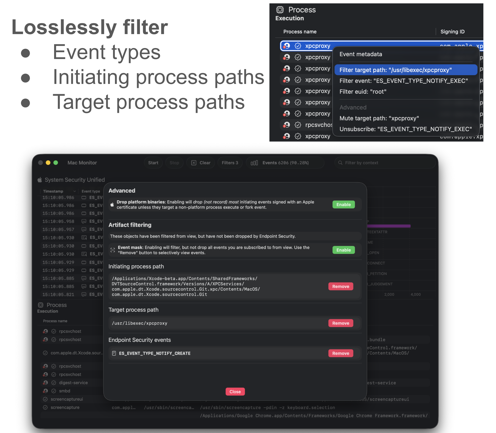

## 🎉 Welcome to "Mac Monitor's" official new home!

Mac Monitor is an **advanced, stand-alone system monitoring tool tailor-made for macOS security research, malware triage, and system troubleshooting**. Leveraging Apple's Endpoint Security (ES) and System Extension APIs, it collects and enriches system events, displaying them graphically, with an expansive feature set designed to surface only the events that are relevant to you. The telemetry collected includes process, interprocess, memory, XPC, file events, and more in addition to rich metadata, allowing users to contextualize events and tell a story with ease. With an intuitive interface and a rich set of analysis features, Mac Monitor was designed for a wide range of skill levels and backgrounds to detect macOS threats that would otherwise go unnoticed. 

## Requirements
- Processor: We recommend an `Apple Silicon` machine, but `Intel` works too!
- System memory: `4GB+` is recommended
- macOS version: `13.1+` (Ventura)

## How can I install this thing?

**Installer package**
* Go to the releases section and download the latest installer: https://github.com/Brandon7CC/mac-monitor/releases

**Install**
* Open the app: `Mac Monitor.app`
* You'll be prompted to "Open System Settings" to "Allow" the System Extension.
* Next, System Settings will automatically open to `Full Disk Access` -- you'll need to flip the switch to enable this for the `Mac Monitor Security Extension`. Full Disk Access is a [*requirement* of Endpoint Security](https://developer.apple.com/documentation/endpointsecurity/3259700-es_new_client#:~:text=The%20user%20does%20this%20in%20the%20Security%20and%20Privacy%20pane%20of%20System%20Preferences%2C%20by%20adding%20the%20app%20to%20Full%20Disk%20Access.).
* 🏎️ Click the "Start" button in the app and you'll be prompted to reopen the app. Done!

### Install footprint
- Event monitor app which establishes an XPC connection to the Security Extension: `/Applications/Mac Monitor.app` w/signing identifier of `com.swiftlydetecting.agent`.
- Security Extension: `/Library/SystemExtensions/../com.swiftlydetecting.agent.securityextension.systemextension` w/signing identifier of `com.swiftlydetecting.agent.securityextension.systemextension`.

## Uninstall
* **From the Finder** delete the app and authenticate to remove the System Extension. You can't do this from the Dock. It's that easy!
* You can also *just* remove the Security Extension if you want in the app's menu bar or by going into the app settings.
* (`1.0.3+`) Supports removal using the `../Contents/SharedSupport/uninstall.sh` script.

## What are some standout features?
- **High fidelity ES events modeled and enriched** with some events containing further enrichment. For example, a process being File Quarantine-aware, a file being quarantined, code signing certificates, etc.
- **Dynamic runtime ES event subscriptions**. You have the ability to on-the-fly modify your event subscriptions -- enabling you to cut down on noise while you're working through traces.
- **Path muting at the API level** -- Apple's Endpoint Security team has put a lot of work recently into enabling advanced path muting / inversion capabilities. Here, we cover the majority of the API features: `es_mute_path` and `es_mute_path_events` along with the types of `ES_MUTE_PATH_TYPE_PREFIX`, `ES_MUTE_PATH_TYPE_LITERAL`, `ES_MUTE_PATH_TYPE_TARGET_PREFIX`, and `ES_MUTE_PATH_TYPE_TARGET_LITERAL`. Right now we do not support inversion. **I'd love it if the ES team added inversion on a per-event basis instead of per-client**.

- **Detailed event facts**. **Right click on any event** in a table row to access event metadata, filtering, muting, and unsubscribe options. Core to the user experience is the ability to drill down into any given event or set of events. To enable this functionality we’ve developed “Event facts” windows which contain metadata / additional enrichment about any given event. Each event has a curated set metadata that is displayed. For example, process execution events will generally contain code signing information, environment variables, correlated events, etc. Below you see examples of file creation and BTM launch item added event facts.

- **Event correlation** is an *exceptionally* important component in any analyst's tool belt. The ability to see which events are "related" to one-another enables you to manipulate the telemetry in a way that makes sense (other than simply dumping to JSON or representing an individual event). We perform event correlation at the process level -- this means that for any given event (which have an initiating and/or target process) we can deeply link events that any given process instigated. 
- **Process grouping** is another helpful way to represent process telemetry around a given `ES_EVENT_TYPE_NOTIFY_EXEC` or `ES_EVENT_TYPE_NOTIFY_FORK` event. By grouping processes in this way you can easily identify the chain of activity.
- **Artifact filtering** enabled users to remove (but not destroy) events from view based on: event type, initiating process path, or target process path. This standout feature enables analysts to cut through the noise quickly while still retaining all data.
  - Lossy filtering (i.e. events that are dropped from the trace) is also available in the form of "dropping platform binaries" -- another useful technique to cut through the noise.

- **Telemetry export**. Right now we support pretty JSON and JSONL (one JSON object per-line) for the full or partial system trace (keyboard shortcuts too). You can access these options in the menu bar under "Export Telemetry".
- **Process subtree generation**. When viewing the event facts window for any given event we’ll attempt to generate a process lineage subtree in the left hand sidebar. This tree is intractable – click on any process and you’ll be taken to its event facts. **Similarly, you can right click on any process in the tree to pop out the facts for that event**.
- **Dynamic event distribution chart**. This is a fun one enabled by the SwiftUI team. The graph shows the distribution of events you're subscribed to, currently in-scope (i.e. not filtered), and have a count of more than nothing. This enables you to *very* quickly identify noisy events. The chart auto-shows/hides itself, but you can bring it back with the: "Mini-chart" button in the toolbar.

## Some other features
- Another very important feature of any dynamic analysis tool is to not let an event limiter or memory inefficient implementation get in the way of the user experience. To address this (the best we currently can) we’ve implemented an asynchronous parent / child-like **Core Data stack** which stores our events as “entities” in-memory. This enables us to store virtually unlimited events with Mac Monitor. Although, the time of insertions does become more taxing as the event limit gets very large.  
- Since Mac Monitor is based on a Security Extension which is always running in the background (like an EDR sensor) we baked in functionality such that it **does not process events when a system trace is not occurring**. This means that the Security Extension (`com.swiftlydetecting.agent.securityextension`) will not needlessly utilize resources / battery power when a trace is not occurring. 
- Distribution package: **The install process is often overlooked**. However, if users do not have a good understanding of what’s being installed or if it’s too complex to install the barrier to entry might be just high enough to dissuade people from using it. This is why we ship Mac Monitor as a notarized distribution package.